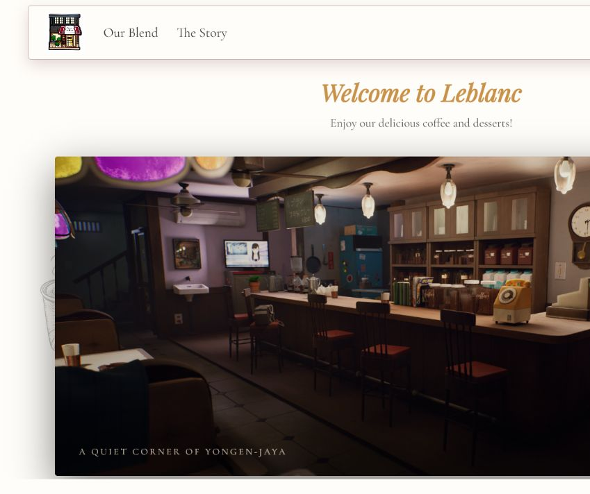
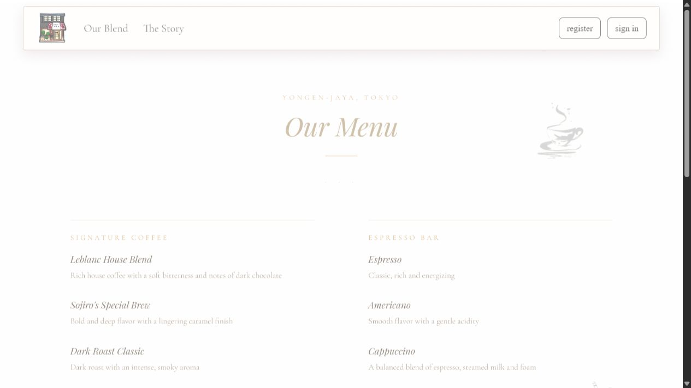

# LeblancCoffe

Fan-made cafe website inspired by Leblanc from Persona 5. The project focuses on atmosphere, elegant typography, responsive layout, and a simple interactive sign-up flow for practice.

## Screenshots





![Register page](docs/screenshots/register.png<<<<<< HEAD
 
=======

## Features
>>>>>>> 02634ddff92395010d3cd4ff9cbdfd0b6cefed4a

- Responsive navigation for desktop and mobile screens.
- Atmospheric carousel on the home page.
- Menu and story pages styled around a quiet Tokyo cafe mood.
- Demo registration and sign-in flow using `localStorage`.
- Smooth page transitions between internal pages.
- Lightweight static setup: HTML, CSS, and vanilla JavaScript.

## Demo Auth Flow

The register page stores a demo account in the browser with `localStorage`. The sign-in page checks the saved username and password, then creates a small demo session and redirects back to the home page.

This is not a real backend authentication system. It is only an interface simulation for a static practice project.

## Run Locally

```bash
python -m http.server 8080
```

Then open:

```text
http://127.0.0.1:8080/index.html
```

## Project Structure

```text
.
├── images/
├── docs/screenshots/
├── about.html
├── index.html
├── menu.html
├── navbar.html
├── navbar.js
├── register.html
├── signin.html
├── site.js
└── styles.css
```

## Notes

The site is fictional and made for learning layout, UI polish, and basic browser-side interactions.
